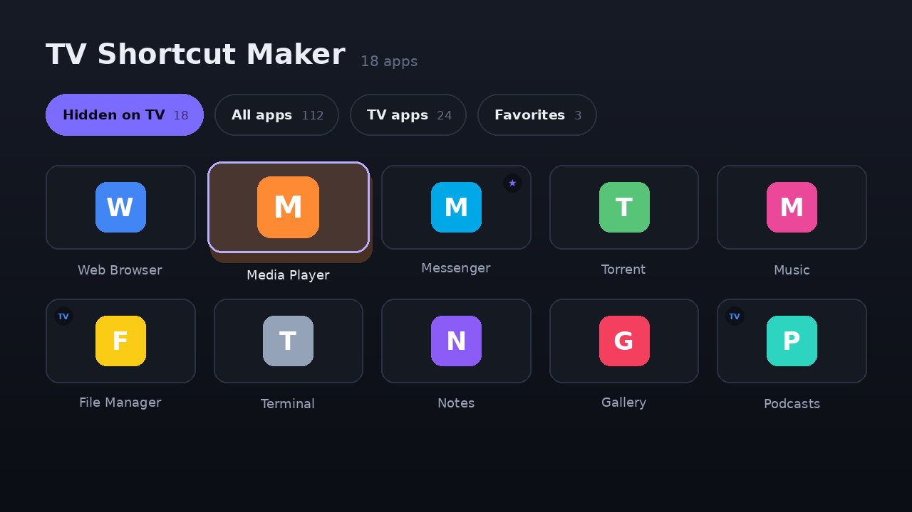
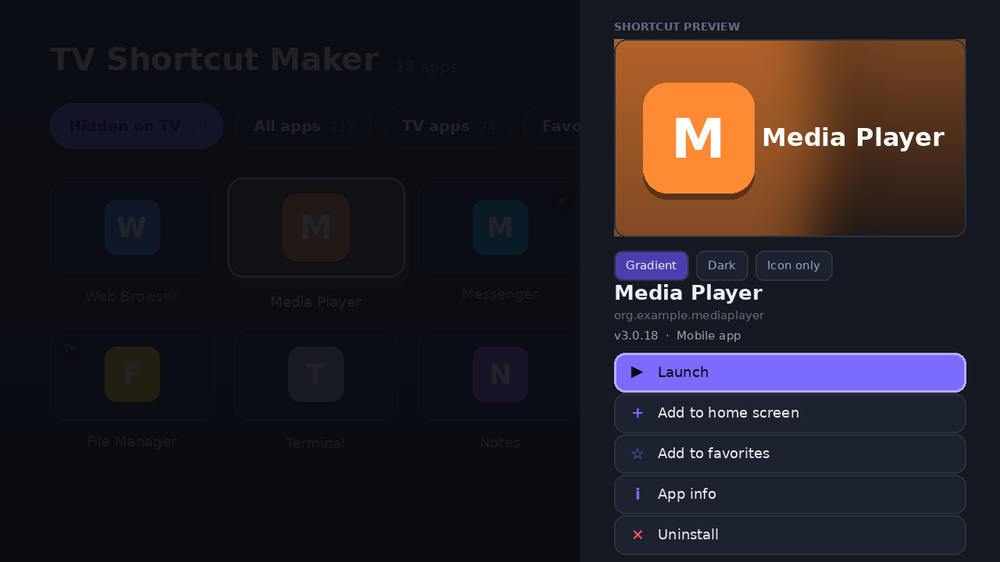
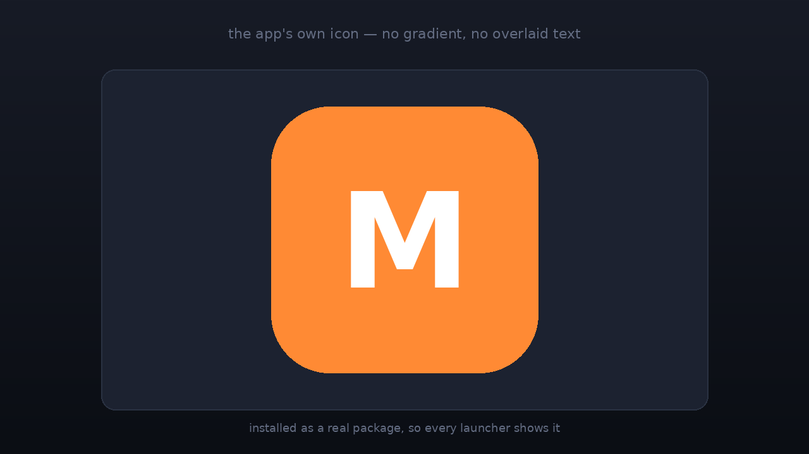

<div align="center">



# 📺 TV Sideload Shortcut Maker

**Запускайте любое сайдлоуд-приложение на Android TV — с баннером, который не стыдно показать.**

[](https://developer.android.com/tv)
[](https://developer.android.com)
[](https://kotlinlang.org)
[](https://developer.android.com/training/tv/playback/compose)
[](LICENSE)

**Русский** · [English](README.en.md)

</div>

---

## 🤔 Проблема

Лаунчер Android TV показывает только те приложения, которые объявили
`CATEGORY_LEANBACK_LAUNCHER` в своём манифесте. Устанавливаете сайдлоудом
мобильное приложение — браузер, торрент-клиент, IPTV-плеер — оно ставится без
единой ошибки и **остаётся невидимым**. Обычные обходные пути: неудобные
файловые менеджеры или «панели приложений», забитые рекламой.

**TV Sideload Shortcut Maker** находит такие скрытые приложения, генерирует из
их собственной иконки полноценный leanback-баннер 320×180 и закрепляет ярлык на
главном экране. Заодно работает как быстрая и красивая панель запуска сама по себе.

## ✨ Возможности

| | |
|---|---|
| 🔍 **Полное сканирование** | Список всех установленных пакетов, включая приложения без leanback-точки входа |
| 🎯 **Умные фильтры** | `Скрытые на ТВ` · `Все приложения` · `ТВ-приложения` · `Избранное`, у каждого — счётчик |
| 🖼 **Генератор баннеров** | Извлекает иконку из APK и компонует её на холсте 16:9 в тройном разрешении |
| 🎨 **Иконка как есть** | Оригинальная иконка приложения без градиентов и подписей — ярлык неотличим от обычного приложения |
| 📌 **Закреплённые ярлыки** | `ShortcutManagerCompat.requestPinShortcut()` через activity-трамплин |
| 🚀 **Встроенная панель** | Запуск чего угодно напрямую, даже если лаунчер отказывается закреплять ярлыки |
| ⭐ **Избранное** | Хранится локально, всегда в одном нажатии пульта |
| 🎮 **Сделано под пульт** | Увеличение при фокусе, анимированные контуры, тени глубины, отступы с запасом на overscan 5 % |
| 🌑 **Тёмная тема** | Почти чёрный фон с фиолетово-синими акцентами — щадит OLED-панели |
| 📱 **Работает и на телефоне** | Вертикальная ориентация, сетка подстраивается под ширину экрана, панель сведений раскрывается на весь экран |

## 📸 Скриншоты

> Замените заглушки реальными снимками: `adb exec-out screencap -p > shot.png`

| Сетка приложений | Панель сведений | Иконка ярлыка |
|---|---|---|
|  |  |  |

## 🏗 Архитектура

Классический **MVVM**, без DI-фреймворка — самописный `AppContainer` оставляет
код читаемым и пригодным для копирования.

```
UI (Compose for TV)  ──наблюдает──▶  AppListViewModel  ──вызывает──▶  Repository / Helpers
      │                                    │                              │
  AppDrawerScreen                    StateFlow<AppListUiState>       AppRepository
  AppDetailPanel                                                     BannerFactory
  AppCard / TvControls                                               ShortcutHelper
                                                                     FavoritesStore
```

**Как на самом деле работает ярлык**

```
Лаунчер ТВ ──▶ закреплённый ярлык ──▶ LaunchProxyActivity ──▶ целевое приложение
                (баннер + подпись)      (резолвит интент)
```

Activity-трамплин прозрачна и помечена `noHistory`, так что пользователь её не
видит. Такая развязка позволяет ярлыку пережить обновление целевого приложения
и откатываться между leanback- и обычной точкой входа.

## 📁 Структура проекта

```
TV-Sideload-Shortcut-Maker/
├── build.gradle.kts                 # плагины уровня проекта
├── settings.gradle.kts
├── gradle/libs.versions.toml        # каталог версий (единый источник правды)
├── app/
│   ├── build.gradle.kts
│   ├── proguard-rules.pro
│   └── src/main/
│       ├── AndroidManifest.xml      # leanback-флаг + QUERY_ALL_PACKAGES
│       ├── java/com/tvshortcut/maker/
│       │   ├── MainActivity.kt
│       │   ├── TvShortcutApplication.kt
│       │   ├── data/
│       │   │   ├── AppRepository.kt      # скан пакетов + резолв интентов
│       │   │   ├── BannerFactory.kt      # извлечение иконок + рендер 320x180
│       │   │   ├── ShortcutHelper.kt     # закреплённые / динамические ярлыки
│       │   │   ├── FavoritesStore.kt
│       │   │   └── model/AppInfo.kt
│       │   ├── launch/LaunchProxyActivity.kt
│       │   ├── ui/
│       │   │   ├── theme/{Color,Type,Theme}.kt
│       │   │   ├── components/{AppCard,TvControls,StatusViews,TvInteraction}.kt
│       │   │   └── screens/{AppDrawerScreen,AppDetailPanel}.kt
│       │   └── viewmodel/AppListViewModel.kt
│       └── res/{values,drawable,mipmap-*}
└── docs/screenshots/
```

## 🛠 Стек технологий

- **Kotlin 2.0.21** + Coroutines
- **Jetpack Compose for TV** (`androidx.tv:tv-material:1.0.0`)
- **AndroidX Palette** для извлечения акцентного цвета
- **MVVM** на `StateFlow` / `collectAsStateWithLifecycle`
- AGP 8.7.2 · Gradle 8.9 · JDK 17

## 🚀 Сборка

Gradle-wrapper лежит в репозитории, поэтому ставить Gradle отдельно не нужно —
требуются только **JDK 17** и **Android SDK** (platform 35 + build-tools).

```bash
git clone https://github.com/<ваш-ник>/TV-Sideload-Shortcut-Maker.git
cd TV-Sideload-Shortcut-Maker

./gradlew assembleDebug
# → app/build/outputs/apk/debug/app-debug.apk
```

Либо просто откройте папку в **Android Studio Ladybug (2024.2)+** и нажмите ▶.

<details>
<summary>Релизная сборка со своим ключом подписи</summary>

```bash
keytool -genkey -v -keystore release.keystore -alias tvshortcut \
        -keyalg RSA -keysize 2048 -validity 10000

./gradlew assembleRelease
```
</details>

## 🤖 CI — APK собирается сам

`.github/workflows/build.yml` собирает debug-APK при каждом пуше и выкладывает
его как артефакт сборки, так что Android SDK можно вообще не устанавливать.

```bash
# залить проект и дать GitHub его собрать
./push-to-github.sh                 # нужен GitHub CLI: gh auth login

gh run watch                        # следить за сборкой
gh run download --name tv-shortcut-maker-debug   # забрать APK
```

Пуш тега дополнительно публикует GitHub Release с приложенным APK:

```bash
git tag v1.0.0 && git push origin v1.0.0
```

Можно и вовсе без терминала: создайте репозиторий на github.com, перетащите
файлы через **uploading an existing file**, затем откройте вкладку **Actions** —
готовый APK появится в разделе **Artifacts**. Следите, чтобы загрузилась скрытая
папка `.github`, иначе автосборка не запустится.

## 📥 Установка на телевизор

```bash
# 1. Включите на ТВ режим разработчика → отладку по USB/сети
# 2. Посмотрите IP телевизора в Настройки → Сеть
adb connect 192.168.1.42:5555
adb install -r app-debug.apk
```

Либо перенесите APK через *Downloader (AFTV)*, *Send files to TV* или обычную
USB-флешку.

> ⚠️ **При первом запуске:** на Android 11+ приложению нужно разрешение
> `QUERY_ALL_PACKAGES`, чтобы видеть сайдлоуд-приложения. Это обычное
> install-time разрешение — диалога не будет, — но именно из-за него приложение
> не распространяется через Google Play.

## 🧭 Как пользоваться

1. Откройте **TV Shortcut Maker** с главного экрана.
2. Фильтр по умолчанию **Скрытые на ТВ** уже показывает то, что прячет лаунчер.
3. Наведитесь на приложение → **OK** открывает панель деталей (**долгое нажатие OK** запускает сразу).
4. Выберите стиль баннера, посмотрите превью, нажмите **Добавить на главный экран**.
5. Подтвердите диалог закрепления от лаунчера. Готово.

## ⚠️ Известные ограничения

- **Закрепление зависит от лаунчера.** Google TV и большинство AOSP-лаунчеров
  принимают закреплённые ярлыки; часть вендорских прошивок (некоторые сборки
  Xiaomi/Realme) молча игнорируют запрос. На этот случай есть встроенная панель
  и **Избранное** — приложение прямо сообщит, если закрепление не поддерживается.
- Мобильные приложения, не рассчитанные на ТВ, могут открываться в портретной
  ориентации, игнорировать D-Pad или требовать мышь. Помогает приложение-пульт с
  эмуляцией мыши. Это ограничение самого приложения, а не ярлыка.
- `QUERY_ALL_PACKAGES` — ограниченное разрешение в Google Play. Проект рассчитан
  на сайдлоуд / распространение в духе F-Droid.

## 🗺 Планы

- [ ] Выбор своей картинки для баннера (загрузка PNG/JPG)
- [ ] Публикация каналов/рядов через `TvProvider` для лаунчеров без поддержки закрепления
- [ ] Пакетное создание ярлыков
- [ ] Поиск с экранной клавиатурой
- [ ] Резервное копирование и восстановление избранного

## ❤️ Поддержать проект

Приложение бесплатное, без рекламы и без сбора данных — и таким останется.
Если оно сэкономило вам время, автора можно поддержать:

- ☕ [Boosty](https://boosty.to/tvshortcutmaker/donate) — разовый донат любой суммой, картой РФ
- ⭐ Бесплатно и тоже полезно: поставьте звезду репозиторию и расскажите о проекте

Донаты идут на тестовые устройства (TV-боксы разных вендоров ведут себя
по-разному) и на время, потраченное на разбор багов.

## 🤝 Участие в разработке

PR приветствуются. Комментарии в коде — на английском, стиль — официальный
Kotlin (`kotlin.code.style=official`), перед открытием PR прогоняйте
`./gradlew lint`.

## 👤 Автор

**В. Д. Кривицкий** — идея, архитектура и разработка.

Нашли ошибку или есть предложение? Откройте
[issue](../../issues) — это лучший способ связаться.

## 📄 Лицензия

MIT © 2026 В. Д. Кривицкий — см. [LICENSE](LICENSE).

<div align="center">
<sub>Проект не связан с Google. Android TV — товарный знак Google LLC.</sub>
</div>
